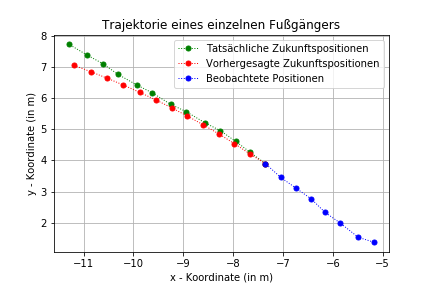
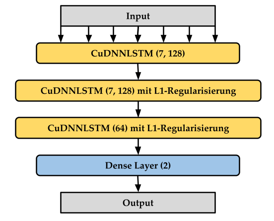
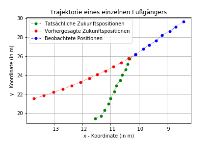
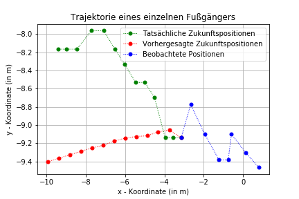
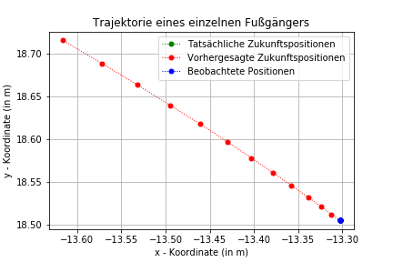

# Trainieren eines Neuronalen Netzes zur Prädiktion der Trajektorie von Fußgängern
Modulprüfung zum Thema "Trajektorien-Prädiktion von Fußgängern" im Fach "Computational Intelligence" an der Universität Regensburg im Sommersemester 2021. 
- [Projektdokumentation](Dokumentation/Projektdokumentation.pdf) 
- [Annotierter Code in Form eines Jupyter-Notebooks](PedestrianTrajectoryPrediction.ipynb)

## Aufgabe
Ziel der Projektarbeit ist die Vorhersage der zukünftigen Trajektorie/Bewegungsbahn eines Fußgängers, basierend auf bekannten, vergangenen Positionen. Ganz speziell sind in diesem Fall die ersten 8 Positionen eines Fußgängers gegeben und mit diesen Informationen sollen die nächsten 12 prädiziert werden. Die Aufgabenstellung wird auch nochmal in Abb. 1 verdeutlicht.  

	
	 
	<em>
		Abbildung 1: Beispiel-Trajektorie eines Fußgängers. Mithilfe der ersten acht beobachteten  
		Positionen (blau) prädiziert das System die zukünftigen zwölf (rot). Die vorhergesagte  
		Trajektorie sollte dabei möglichst nah an der Ground-Trouth (grün) liegen.
	</em>

## Lösungsansatz
Der gegebenen Datensatz mit den Positionsdaten wurde zunächst in Trainings-, Validierungs- und Testdaten aufgeteilt. Die Trainingsdaten wurden dann normalisert (Transformation der absoluten Positionskoordinaten in relative Positionsänderungen) und mithilfe einer z-Transformation standardisiert. Anschließend wurde ein auf LSTM basierendes Neuronales Netz (Architektur siehe Abb. 2) für insgesamt 30 Epochen (Batch size = 16, Lernrate = 5\*10^-5) trainiert. 

	
	 
	<em>
		Abbildung 1: Architektur des trainierten Models. Klammern enthalten die Form des Outputs  
		einer Schicht.
	</em>

## Evaluation
### Performance
Der vorgestellte Ansatz wurde dann anhand zweier gängiger Metriken evaluiert.
- **Average displacement error (ADE)**: Durchschnittliche Fehler zwischen prädizierten Positionen und Ground-Trouth für alle (12) vorhergesagten Zeitschritte von allen Fußgängern des Testdatensatzes.
- **Final displacement error (FDE)**: Der durchschnittliche Fehler zwischen prädizierter Position und Ground-Trouth zum finalen Zeitpunkt eines Fußgängers, für allen Fußgängern des Testdatensatzes.

Das vorgestellte System erreicht dabei einen __FDE von 0,76__ und einen **ADE von 1,56**.

### Failure Cases
Durch eine **qualitative Analyse** der vom System getroffenen Vorhersagen konnten einige Failure Cases des Ansatzes festgestellt werden:

	
	 
	<em>
		Abbildung 3: Überraschende Richtungsänderung.
	</em>

- Plötzlichen Richtungsänderungen bei keinerlei Hinweisen in den beobachteten Daten (Abb. 3). In diesem Fall sind zusätzliche Kontextinformationen (über Straßenverlauf, andere Fußgänger, Objekte in der Wegbahn, etc.) notwendig, um bessere Vorhersagen treffen zu können.

	
	 
	<em>
		Abbildung 4: Mehrfache Richtungs- oder Geschwindigkeitsänderungen.
	</em>

- Auch häufige Richtungs- oder Geschwindigkeitsänderungen führen zu Problemen bei der Vorhersage (Abb. 4). Ein richtiges Muster ist auch für den Menschen schwer zu erkennen. Erneut sind zusätzliche Kontextinformationen nötig.

	
	 
	<em>
		Abbildung 5: Keine Positionsänderung.
	</em>

- Keine Fortbewegung des Fußgängers (Abb. 5). Bei keinerlei x- und y- Positionsänderungen weichen die Vorhersagen des Systems geringfügig von |0| ab. Durch das sequentielle Vorgehen bei den Vorhersagen akkumuliert sich dann der Fehler. 
